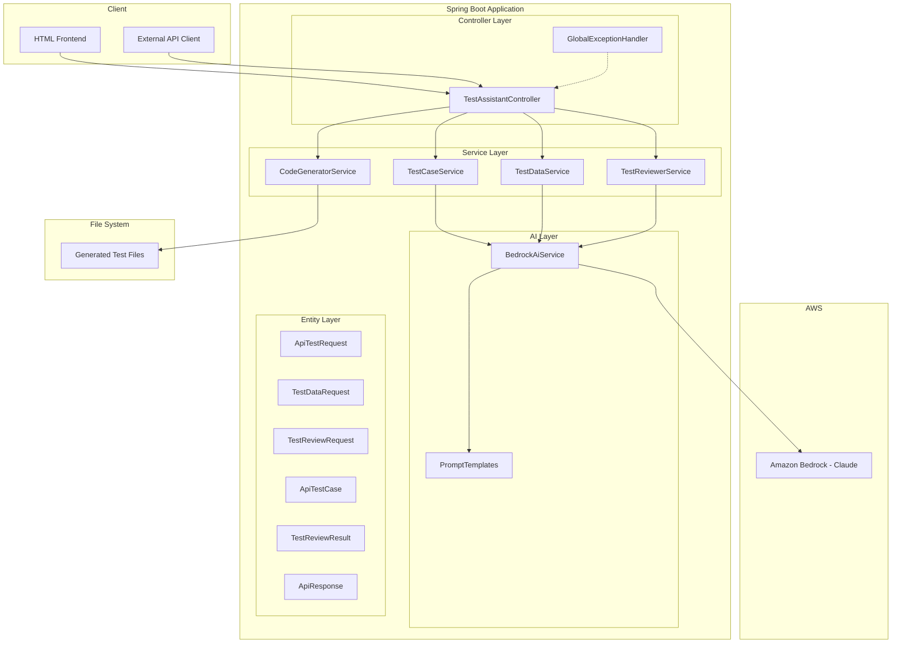
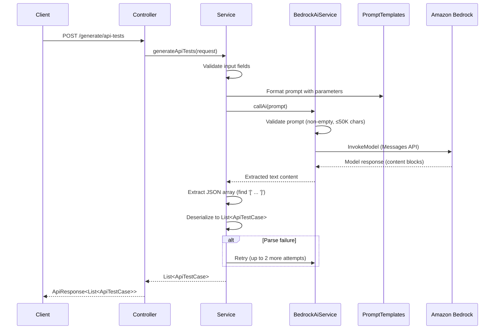
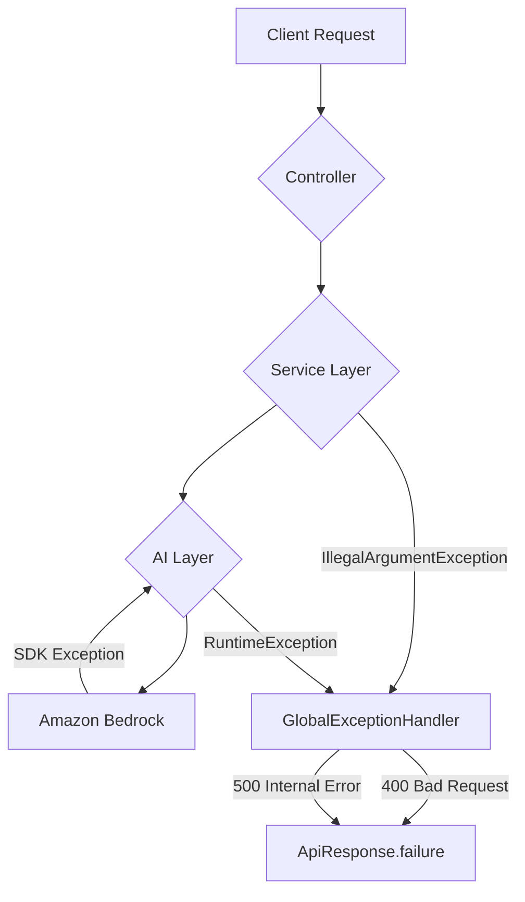

# Design Document: AI QA Assistant

## Overview

The AI QA Assistant is a Spring Boot 3.3.x REST API that automates QA engineering tasks by leveraging Amazon Bedrock (Claude model) for AI-powered test generation and review. The system exposes four core capabilities via HTTP POST endpoints:

1. **API Test Case Generation** — Produces structured test cases (positive, negative, boundary, security) from endpoint metadata
2. **Test Data Generation** — Creates realistic test data objects from a JSON schema definition
3. **RestAssured Code Generation** — Generates runnable Java test files and writes them to disk
4. **AI Test Review** — Analyzes existing test code and returns coverage assessments with improvement suggestions

The application uses AWS-native Amazon Bedrock, the AWS SDK for Java v2, and resolves credentials via the default credential provider chain. All AI interactions enforce JSON-only responses through structured prompt templates.

### Design Decisions

| Decision | Rationale |
|----------|-----------|
| Amazon Bedrock | AWS-native service uses IAM for auth and aligns with Delta's cloud-first strategy |
| Anthropic Messages API format | Claude on Bedrock uses this format; provides structured message roles and content blocks |
| Centralized prompt templates | Single class with `public static final` constants prevents prompt drift across services |
| JSON extraction via delimiter search | AI responses may include preamble text; bracket/brace extraction is a pragmatic fallback for non-deterministic output |
| Retry logic (3 attempts) for test case generation | AI output is non-deterministic; retries increase reliability for the most complex generation task |
| Generic `ApiResponse<T>` wrapper | Consistent contract simplifies client parsing for both success and error cases |
| File-based code output | Generated RestAssured tests are written to a configurable directory for immediate IDE integration |

## Architecture



### Request Flow



## Components and Interfaces

### 1. BedrockAiService (ai package)

Uses AWS SDK v2 Bedrock Runtime client.

```java
@Service
public class BedrockAiService {

    private final BedrockRuntimeClient bedrockClient;
    private final String modelId;        // from aws.bedrock.model-id
    private final int maxTokens;         // default 4096
    private final int timeoutSeconds;    // default 30

    /**
     * Sends a prompt to Claude on Bedrock and returns the text from the first content block.
     *
     * @param prompt Non-null, non-blank string, max 50,000 characters
     * @return AI response text
     * @throws RuntimeException if prompt is empty/blank, exceeds max length,
     *         Bedrock returns an error, or request times out
     */
    public String callAi(String prompt);
}
```

### 2. PromptTemplates (ai package)

Centralized prompt constants. No changes to interface, but prompt content updated for Claude's format.

```java
public final class PromptTemplates {
    public static final String API_TEST_PROMPT = "...";      // parameterized: endpoint, method, schema
    public static final String TEST_DATA_PROMPT = "...";     // parameterized: count, schema
    public static final String TEST_REVIEW_PROMPT = "...";   // parameterized: framework, endpoint, testCode
}
```

### 3. TestCaseService (service package)

```java
@Service
public class TestCaseService {

    /**
     * Generates API test cases from endpoint metadata.
     * Retries up to 3 total attempts on parse failure.
     *
     * @param request Must have non-blank endpoint and method
     * @return List of at least 8 test cases
     * @throws IllegalArgumentException if endpoint or method is blank
     * @throws RuntimeException after 3 failed parse attempts
     */
    public List<ApiTestCase> generateApiTests(ApiTestRequest request);
}
```

### 4. TestDataService (service package)

```java
@Service
public class TestDataService {

    /**
     * Generates 5 test data objects from a schema definition.
     *
     * @param request Must have non-null, non-empty schema map
     * @return List of 5 test data maps
     * @throws IllegalArgumentException if schema is null or empty
     * @throws RuntimeException if AI response cannot be parsed
     */
    public List<Map<String, Object>> generateTestData(TestDataRequest request);
}
```

### 5. CodeGeneratorService (service package)

```java
@Service
public class CodeGeneratorService {

    /**
     * Generates a RestAssured Java test file and writes it to disk.
     *
     * @param endpoint API endpoint path
     * @param method HTTP method
     * @param testCases List of test cases to generate methods for
     * @return Success message with generated filename
     * @throws RuntimeException if file write fails
     */
    public String generateRestAssuredTests(String endpoint, String method, List<ApiTestCase> testCases);
}
```

### 6. TestReviewerService (service package)

```java
@Service
public class TestReviewerService {

    /**
     * Reviews test code using AI and returns structured feedback.
     *
     * @param request Must have non-blank testCode
     * @return Structured review result
     * @throws IllegalArgumentException if testCode is blank
     * @throws RuntimeException if AI response cannot be parsed
     */
    public TestReviewResult reviewTests(TestReviewRequest request);
}
```

### 7. TestAssistantController (controller package)

| Endpoint | Method | Request Body | Response |
|----------|--------|--------------|----------|
| `/generate/api-tests` | POST | `ApiTestRequest` | `ApiResponse<List<ApiTestCase>>` |
| `/generate/test-data` | POST | `TestDataRequest` | `ApiResponse<List<Map<String, Object>>>` |
| `/generate/restassured-tests` | POST | `ApiTestRequest` | `ApiResponse<String>` |
| `/review/tests` | POST | `TestReviewRequest` | `ApiResponse<TestReviewResult>` |

### 8. GlobalExceptionHandler (controller package)

| Exception Type | HTTP Status | Response |
|----------------|-------------|----------|
| `IllegalArgumentException` | 400 | `ApiResponse.failure(ex.getMessage())` |
| `RuntimeException` | 500 | `ApiResponse.failure(ex.getMessage())` |
| `Exception` | 500 | `ApiResponse.failure("Something went wrong: " + sanitized message)` |

## Data Models

### Request Models

```java
// ApiTestRequest
{
    "endpoint": String,    // required, non-blank
    "method": String,      // required, non-blank (GET, POST, PUT, DELETE, PATCH)
    "schema": Map<String, Object>  // optional, JSON schema of request body
}

// TestDataRequest
{
    "schema": Map<String, Object>  // required, non-null, non-empty map
}

// TestReviewRequest
{
    "testCode": String,    // required, non-blank
    "endpoint": String,    // optional, defaults to "unknown"
    "framework": String    // optional, defaults to "unknown"
}
```

### Response Models

```java
// ApiResponse<T> — Generic envelope
{
    "success": boolean,
    "message": String,     // max 500 characters
    "data": T              // null when success is false
}

// ApiTestCase
{
    "testName": String,
    "description": String,
    "input": Map<String, Object>,
    "expectedResult": {
        "statusCode": int,
        "responseBody": Map<String, Object>
    }
}

// TestReviewResult
{
    "totalTestsFound": int,
    "coverageScore": String,        // e.g., "65%"
    "overallFeedback": String,
    "missingScenarios": List<String>,
    "suggestions": List<String>,
    "goodPracticesFound": List<String>
}
```

### Configuration Properties

| Property | Type | Default | Description |
|----------|------|---------|-------------|
| `aws.bedrock.region` | String | — (required) | AWS region for Bedrock |
| `aws.bedrock.model-id` | String | — (required) | Claude model identifier |
| `aws.bedrock.timeout` | int | 30 | Request timeout in seconds |
| `aws.bedrock.max-tokens` | int | 4096 | Max tokens in AI response |
| `test.output.path` | String | `src/test/java/generated` | Output directory for generated tests |
| `server.port` | int | 8080 | Server listening port |


## Correctness Properties

*A property is a characteristic or behavior that should hold true across all valid executions of a system — essentially, a formal statement about what the system should do. Properties serve as the bridge between human-readable specifications and machine-verifiable correctness guarantees.*

### Property 1: Prompt input validation rejects invalid prompts

*For any* string that is null, empty, or composed entirely of whitespace characters, `BedrockAiService.callAi()` SHALL throw a RuntimeException without invoking the Bedrock API. Additionally, *for any* string with length exceeding 50,000 characters, `callAi()` SHALL throw a RuntimeException indicating the length limit was exceeded.

**Validates: Requirements 1.8, 1.9**

### Property 2: Bedrock error exceptions contain required context

*For any* Bedrock API error (timeout, throttling, model error, access denied), the thrown RuntimeException message SHALL contain the error type identifier, the configured model identifier, and a human-readable failure reason.

**Validates: Requirements 1.5**

### Property 3: Test case request validation rejects blank fields

*For any* ApiTestRequest where the endpoint field is null or composed entirely of whitespace, `generateApiTests()` SHALL throw an IllegalArgumentException with the message "Endpoint cannot be empty". *For any* ApiTestRequest where the method field is null or composed entirely of whitespace (with a valid endpoint), `generateApiTests()` SHALL throw an IllegalArgumentException with the message "Method cannot be empty".

**Validates: Requirements 2.2, 2.3**

### Property 4: JSON array extraction round-trip

*For any* valid JSON array string (possibly surrounded by arbitrary non-bracket text prefix and suffix), the extraction logic that locates the first `[` and last `]` SHALL produce a substring that is parseable as a JSON array. Conversely, *for any* string that contains no `[` character or no `]` character, the extraction SHALL signal a parse failure.

**Validates: Requirements 2.7, 3.3**

### Property 5: JSON object extraction round-trip

*For any* valid JSON object string (possibly surrounded by arbitrary non-brace text prefix and suffix), the extraction logic that locates the first `{` and last `}` SHALL produce a substring that is parseable as a JSON object. Conversely, *for any* string where `}` does not appear after `{`, the extraction SHALL throw a RuntimeException.

**Validates: Requirements 5.4, 5.5**

### Property 6: Schema validation rejects null and empty maps

*For any* TestDataRequest where the schema field is null or an empty map, `generateTestData()` SHALL reject the request with an error indicating that a non-empty schema is required.

**Validates: Requirements 3.5**

### Property 7: Class name derivation produces valid Java identifiers

*For any* endpoint path string, `formatClassName()` SHALL produce a result that: (a) contains no curly braces, (b) contains no slash characters, (c) starts with an uppercase letter, (d) ends with "ApiTests", and (e) contains only alphanumeric characters between the start and the "ApiTests" suffix.

**Validates: Requirements 4.3**

### Property 8: Method name sanitization produces valid Java method names

*For any* test name string, `formatMethodName()` SHALL produce a result that: (a) contains only alphanumeric characters, and (b) does not begin with a digit (if the input would produce a leading digit, it is prefixed with "test").

**Validates: Requirements 4.4**

### Property 9: Code generation produces structurally complete test classes

*For any* valid endpoint string, HTTP method string, and non-empty list of ApiTestCase objects, `generateRestAssuredTests()` SHALL produce output that contains: (a) the RestAssured static import statement, (b) a `@BeforeAll` annotated setup method with `baseURI = "http://localhost:8080"`, (c) exactly one `@Test` annotated method per test case in the input list, (d) a public class declaration ending with "ApiTests", and (e) a return value matching the pattern "RestAssured test file generated: {className}.java".

**Validates: Requirements 4.1, 4.5, 4.8**

### Property 10: Test review input validation rejects blank test code

*For any* TestReviewRequest where the testCode field is null or composed entirely of whitespace, `reviewTests()` SHALL throw an IllegalArgumentException with the message "Test code cannot be empty".

**Validates: Requirements 5.2**

### Property 11: Error responses do not expose internal system details

*For any* RuntimeException handled by the GlobalExceptionHandler, the response body message field SHALL NOT contain Java stack traces (no "at com." patterns), internal file paths (no "src/" or "C:\" patterns), or fully-qualified internal class names.

**Validates: Requirements 6.5**

### Property 12: Prompt templates are complete and well-formed

*For any* prompt template constant in PromptTemplates, the template text SHALL: (a) contain an explicit instruction to return only JSON (matching text "ONLY" and "JSON" and "no markdown"), and (b) when formatted with valid placeholder values of appropriate types, produce a string with no remaining unresolved `%s` or `%d` format specifiers.

**Validates: Requirements 7.2, 7.6**

## Error Handling

### Error Handling Strategy

The system uses a layered error handling approach:



### Exception Hierarchy

| Layer | Exception Type | Trigger | HTTP Status |
|-------|---------------|---------|-------------|
| AI Layer | `RuntimeException` | Empty/blank prompt | 400 (via IllegalArgument) |
| AI Layer | `RuntimeException` | Prompt exceeds 50K chars | 400 |
| AI Layer | `RuntimeException` | Bedrock API error or timeout | 500 |
| Service Layer | `IllegalArgumentException` | Missing required request fields | 400 |
| Service Layer | `RuntimeException` | JSON parse failure after retries | 500 |
| Service Layer | `RuntimeException` | File write I/O failure | 500 |
| Controller | `Exception` | Any uncaught exception | 500 |

### Error Response Contract

All error responses follow the same `ApiResponse` structure:

```json
{
    "success": false,
    "message": "Human-readable error description (no stack traces, no internal paths)",
    "data": null
}
```

### Retry Strategy

Only the `TestCaseService.generateApiTests()` method implements retry logic:
- **Max attempts**: 3 (1 initial + 2 retries)
- **Trigger**: JSON parse failure when extracting test cases from AI response
- **Scope**: Only the AI call and parse are retried; input validation failures are not retried
- **Failure**: After 3 failed attempts, throws `RuntimeException("AI failed to generate valid test cases after retries")`

### Security Considerations

- Error messages MUST NOT expose stack traces, internal class names, or server file paths
- AWS credentials are never included in error messages
- Prompt content is not echoed back in error responses
- The `GlobalExceptionHandler` sanitizes all messages before returning to the client

## Testing Strategy

### Testing Approach

The project uses a dual testing strategy combining unit tests for specific scenarios with property-based tests for universal correctness guarantees.

### Test Framework Stack

| Tool | Purpose | Scope |
|------|---------|-------|
| JUnit 5 | Test runner and assertions | All tests |
| Mockito | Mocking Bedrock client and services | Unit tests |
| jqwik | Property-based testing | Correctness properties |
| RestAssured | HTTP endpoint testing | Integration tests |
| Spring Boot Test | Application context and MockMvc | Integration tests |

### Property-Based Testing Configuration

- **Library**: [jqwik](https://jqwik.net/) — JUnit 5 compatible PBT library for Java
- **Minimum iterations**: 100 per property test
- **Tag format**: `Feature: ai-qa-assistant, Property {number}: {property_text}`
- Each correctness property maps to exactly one `@Property` annotated test method
- Generators produce random strings, maps, endpoint paths, and error types

### Unit Tests (Example-Based)

| Test Area | Key Scenarios |
|-----------|---------------|
| BedrockAiService | Successful invocation, response parsing, timeout handling |
| TestCaseService | Retry logic (mock AI returns invalid then valid), successful parse |
| TestDataService | Successful data generation, parse failure |
| TestReviewerService | Null framework/endpoint substitution, successful review |
| CodeGeneratorService | File write success, directory creation, I/O failure |
| GlobalExceptionHandler | Each exception type maps to correct HTTP status |
| PromptTemplates | Category/distribution content verification |

### Integration Tests

| Test Area | Scope |
|-----------|-------|
| Controller endpoints | Full request/response cycle with mocked services |
| Application context | Verifies Spring context loads with required properties |
| File generation | End-to-end code generation with temp directory |

### Test Organization

```
src/test/java/com/aamsinghr/ai_qa_assistant/
├── ai/
│   ├── BedrockAiServiceTest.java           # Unit tests
│   └── BedrockAiServicePropertyTest.java   # Properties 1, 2
├── service/
│   ├── TestCaseServiceTest.java            # Unit + integration
│   ├── TestCaseServicePropertyTest.java    # Properties 3, 4
│   ├── TestDataServiceTest.java            # Unit tests
│   ├── TestDataServicePropertyTest.java    # Property 6
│   ├── CodeGeneratorServiceTest.java       # Unit tests
│   ├── CodeGeneratorServicePropertyTest.java # Properties 7, 8, 9
│   └── TestReviewerServicePropertyTest.java  # Properties 5, 10
├── controller/
│   ├── TestAssistantControllerTest.java    # MockMvc tests
│   └── GlobalExceptionHandlerPropertyTest.java # Property 11
└── PromptTemplatesPropertyTest.java        # Property 12
```

### Coverage Goals

- **Line coverage**: ≥ 80% across all source packages
- **Branch coverage**: ≥ 75% for service layer logic
- **Property coverage**: All 12 correctness properties implemented and passing at 100+ iterations each
- **Mutation testing**: Consider adding PIT for critical pure functions (formatClassName, formatMethodName)
