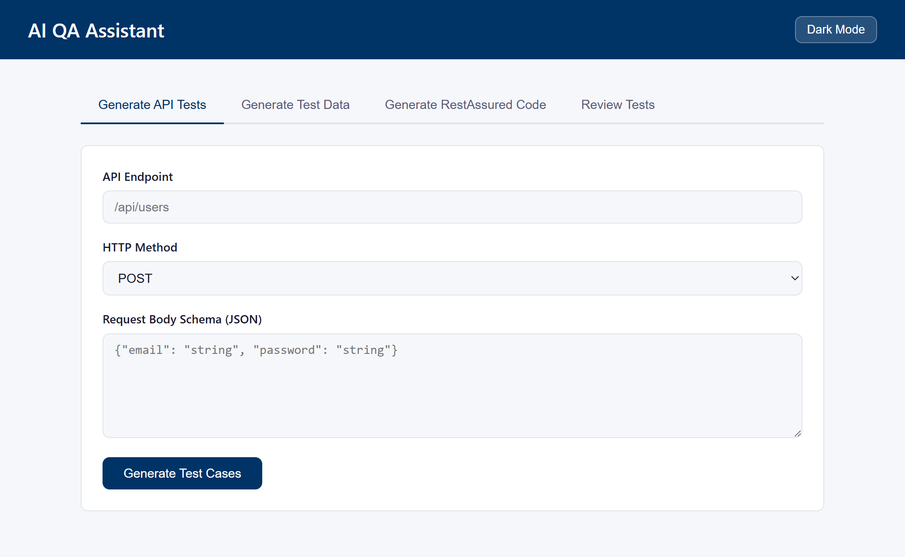
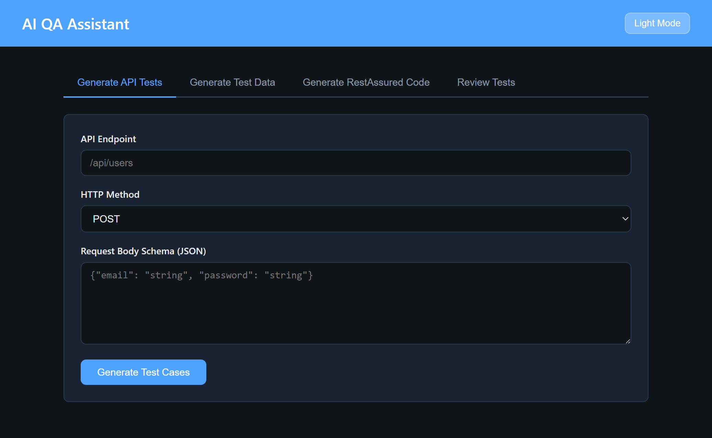
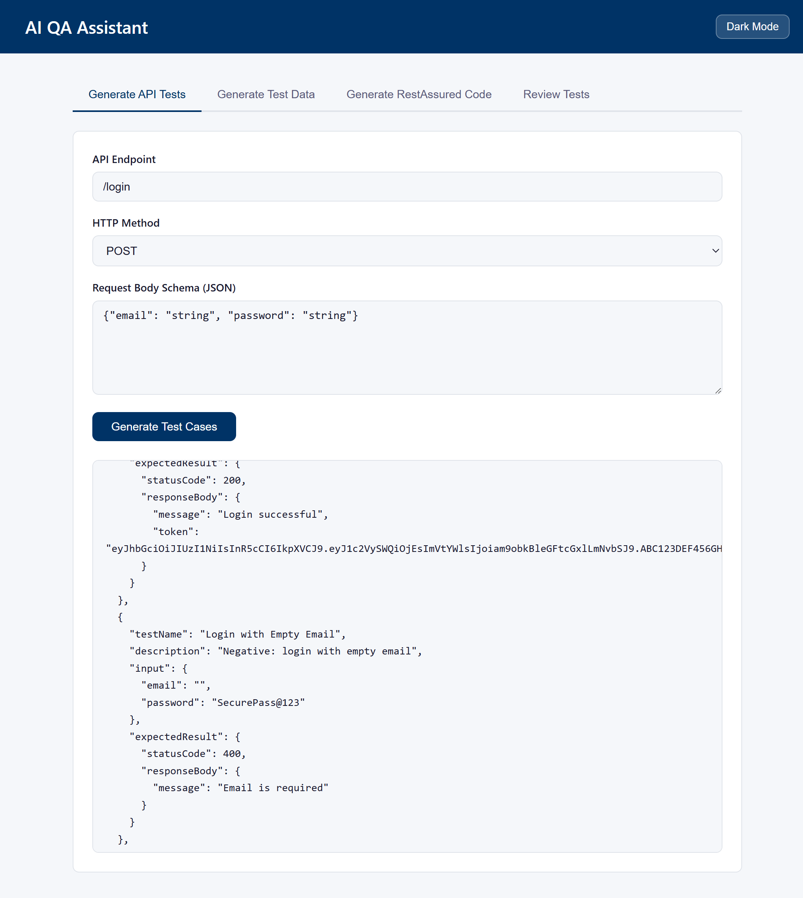
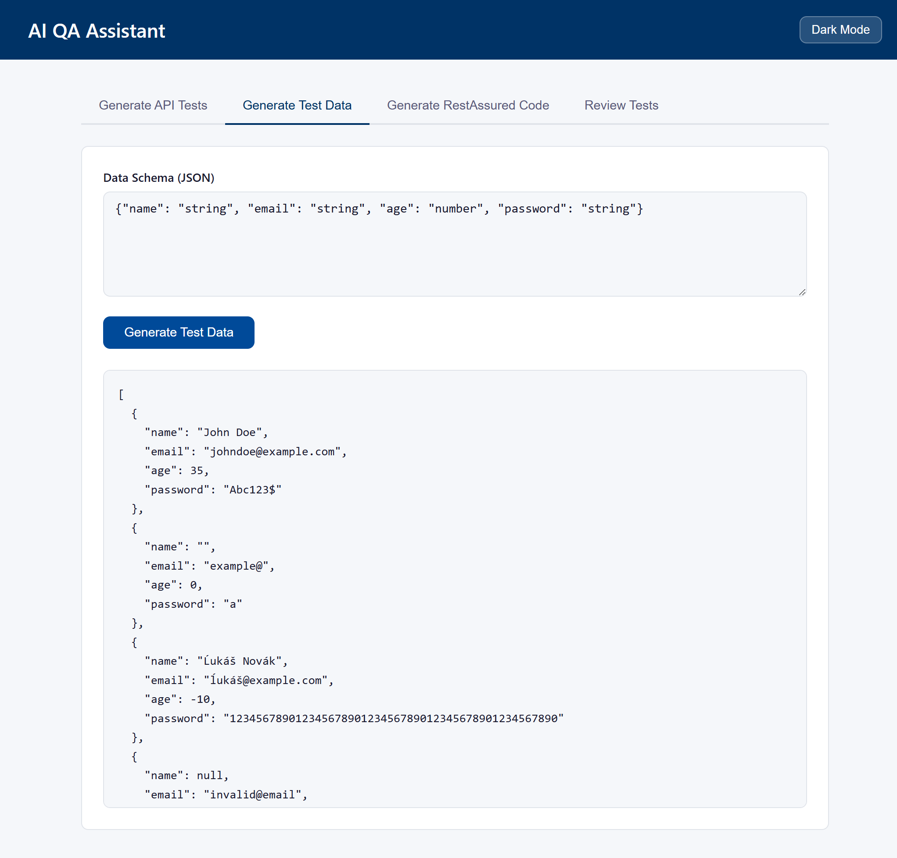
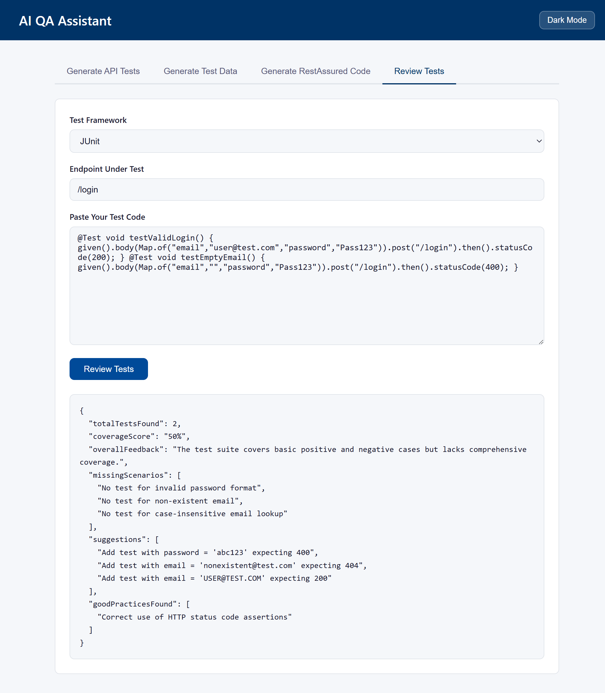

# AI QA Assistant

> An AI-powered productivity tool for QA engineers — generates API test cases, test data, RestAssured code, and reviews existing test coverage using Amazon Bedrock's Claude AI model.


---

## UI Preview

### Light Mode


### Dark Mode


---

## Live Demo Screenshots

### Generate API Tests — Result


### Generate Test Data — Result


### Review Tests — Result


---

## What This Project Does

QA engineers spend hours writing test cases, generating test data, and analyzing failures manually. This tool automates those tasks using AI — giving engineers instant, comprehensive coverage with a single API call.

| Feature | Endpoint | What it does |
|---|---|---|
| API Test Generator | `POST /generate/api-tests` | Generates positive, negative, boundary and security test cases for any endpoint |
| Test Data Generator | `POST /generate/test-data` | Creates realistic test data including valid, invalid, boundary and edge case objects |
| RestAssured Code Generator | `POST /generate/restassured-tests` | Generates and saves a runnable `.java` RestAssured test file to disk |
| AI Test Reviewer | `POST /review/tests` | Reviews any existing test file and returns coverage score, gaps, and suggestions |

---

## Demo

### Generate API Tests

```bash
curl -X POST http://localhost:8080/generate/api-tests ^
  -H "Content-Type: application/json" ^
  -d "{\"endpoint\": \"/login\", \"method\": \"POST\", \"schema\": {\"email\": \"string\", \"password\": \"string\"}}"
```

**Response:**
```json
{
  "success": true,
  "message": "Test cases generated successfully",
  "data": [
    {
      "testName": "Valid Login",
      "description": "Positive: login with valid email and password",
      "input": { "email": "john@example.com", "password": "SecurePass@123" },
      "expectedResult": { "statusCode": 200, "responseBody": { "message": "Login successful", "token": "eyJhbGciOiJIUzI1NiIsInR5cCI6IkpXVCJ9..." } }
    },
    {
      "testName": "Login with Empty Email",
      "description": "Negative: login with empty email",
      "input": { "email": "", "password": "SecurePass@123" },
      "expectedResult": { "statusCode": 400, "responseBody": { "message": "Email is required" } }
    },
    {
      "testName": "Login with Invalid Email Format",
      "description": "Negative: login with invalid email format",
      "input": { "email": "johnatexample.com", "password": "SecurePass@123" },
      "expectedResult": { "statusCode": 400, "responseBody": { "message": "Invalid email format" } }
    },
    {
      "testName": "Login with SQL Injection",
      "description": "Security: login with SQL injection attempt",
      "input": { "email": "' OR '1'='1", "password": "SecurePass@123" },
      "expectedResult": { "statusCode": 403, "responseBody": { "message": "Unauthorized access detected" } }
    },
    {
      "testName": "Login with XSS Injection",
      "description": "Security: login with XSS injection attempt",
      "input": { "email": "<script>alert('XSS Attack')</script>", "password": "SecurePass@123" },
      "expectedResult": { "statusCode": 403, "responseBody": { "message": "Unauthorized access detected" } }
    }
  ]
}
```

---

### Generate Test Data

```bash
curl -X POST http://localhost:8080/generate/test-data ^
  -H "Content-Type: application/json" ^
  -d "{\"schema\": {\"name\": \"string\", \"email\": \"string\", \"age\": \"number\", \"password\": \"string\"}}"
```

**Response:**
```json
{
  "success": true,
  "message": "Test data generated successfully",
  "data": [
    { "name": "John Doe", "email": "johndoe@example.com", "age": 35, "password": "Abc123$" },
    { "name": "", "email": "example@", "age": 0, "password": "a" },
    { "name": "Ĺukáš Novák", "email": "ĺukáš@example.com", "age": -10, "password": "12345678901234567890123456789012345678901234567890" },
    { "name": null, "email": "invalid@email", "age": 150, "password": "" },
    { "name": "!@#$%^&*()_+", "email": "example@example.com", "age": 42, "password": null }
  ]
}
```

---

### Generate RestAssured Code

```bash
curl -X POST http://localhost:8080/generate/restassured-tests ^
  -H "Content-Type: application/json" ^
  -d "{\"endpoint\": \"/users/register\", \"method\": \"POST\", \"schema\": {\"name\": \"string\", \"email\": \"string\", \"password\": \"string\"}}"
```

**Response:**
```json
{
  "success": true,
  "message": "RestAssured test file generated successfully",
  "data": "RestAssured test file generated: UsersRegisterApiTests.java"
}
```

The generated file is saved to `src/test/java/generated/UsersRegisterApiTests.java` and looks like this:

```java
package generated;

import static io.restassured.RestAssured.*;
import io.restassured.RestAssured;
import io.restassured.http.ContentType;
import org.junit.jupiter.api.BeforeAll;
import org.junit.jupiter.api.Test;
import java.util.Map;

public class UsersRegisterApiTests {

    @BeforeAll
    public static void setup() {
        RestAssured.baseURI = "http://localhost:8080";
    }

    @Test
    public void ValidRegistration() {

        Map<String, Object> requestBody = Map.of(
            "name", "John Doe",
            "email", "john@example.com",
            "password", "SecurePass@123"
        );

        given()
            .contentType(ContentType.JSON)
            .body(requestBody)
        .when()
            .post("/users/register")
        .then()
            .statusCode(201);
    }

    @Test
    public void MissingEmail() {

        Map<String, Object> requestBody = Map.of(
            "name", "John Doe",
            "password", "SecurePass@123"
        );

        given()
            .contentType(ContentType.JSON)
            .body(requestBody)
        .when()
            .post("/users/register")
        .then()
            .statusCode(400);
    }
}
```

---

### Review Existing Tests

```bash
curl -X POST http://localhost:8080/review/tests ^
  -H "Content-Type: application/json" ^
  -d "{\"framework\": \"JUnit\", \"endpoint\": \"/login\", \"testCode\": \"@Test void testValidLogin() { ... } @Test void testEmptyEmail() { ... }\"}"
```

**Response:**
```json
{
  "success": true,
  "message": "Test review completed successfully",
  "data": {
    "totalTestsFound": 2,
    "coverageScore": "50%",
    "overallFeedback": "The test suite covers basic positive and negative cases but lacks comprehensive coverage.",
    "missingScenarios": [
      "No test for invalid password format",
      "No test for non-existent email",
      "No test for case-insensitive email lookup"
    ],
    "suggestions": [
      "Add test with password = 'abc123' expecting 400",
      "Add test with email = 'nonexistent@test.com' expecting 404",
      "Add test with email = 'USER@TEST.COM' expecting 200"
    ],
    "goodPracticesFound": [
      "Correct use of HTTP status code assertions"
    ]
  }
}
```

---

## Architecture

```
Client (Browser UI / Postman / curl)
            │
            ▼
  Spring Boot REST API
  (TestAssistantController)
            │
            ▼
     Service Layer
  ┌─────────────────────┐
  │  TestCaseService    │
  │  TestDataService    │
  │  CodeGeneratorSvc   │
  │  TestReviewerSvc    │
  └─────────────────────┘
            │
            ▼
     BedrockAiService
            │
            ▼
  Amazon Bedrock (Claude 3 Haiku)
```

---

## Project Structure

```
src/main/java/com/aamsinghr/ai_qa_assistant/
├── ai/
│   ├── BedrockAiService.java           # Calls Amazon Bedrock API
│   ├── BedrockConfig.java              # AWS client configuration
│   └── PromptTemplates.java            # All AI prompt templates
├── controller/
│   ├── TestAssistantController.java    # All REST endpoints
│   └── GlobalExceptionHandler.java     # Centralized error handling
├── entity/
│   ├── ApiTestRequest.java             # Input for test generation
│   ├── ApiTestCase.java                # Single test case model
│   ├── TestDataRequest.java            # Input for test data
│   ├── TestReviewRequest.java          # Input for test reviewer
│   ├── TestReviewResult.java           # Reviewer output model
│   └── ApiResponse.java               # Universal response wrapper
└── service/
    ├── TestCaseService.java            # Generates test cases via AI
    ├── TestDataService.java            # Generates test data via AI
    ├── CodeGeneratorService.java       # Writes .java files to disk
    └── TestReviewerService.java        # Reviews tests via AI

src/main/resources/
├── static/
│   ├── assets/                        # UI screenshots
│   └── index.html                     # Frontend UI (dark/light mode)
└── application.properties             # App configuration

src/test/java/com/aamsinghr/ai_qa_assistant/
└── controller/
    ├── GlobalExceptionHandlerTest.java
    └── TestAssistantControllerTest.java
```

---

## Tech Stack

| Layer | Technology |
|---|---|
| Language | Java 17 |
| Framework | Spring Boot 3.3.5 |
| AI Runtime | Amazon Bedrock — Claude 3 Haiku (via AWS SDK for Java v2) |
| AWS SDK | AWS SDK for Java 2.25.70 |
| JSON Processing | Jackson ObjectMapper |
| Test Framework | JUnit 5.10.2 + RestAssured 5.4.0 + jqwik 1.8.5 |
| Build Tool | Maven |
| Frontend | HTML + CSS + Vanilla JS (single file, dark/light theme) |
| AI Dev Tools | Kiro (Amazon) — architecture, code generation, prompt engineering |

---

## Getting Started

### Prerequisites

- Java 17+
- Maven
- AWS account with Bedrock access enabled (Claude 3 Haiku model enabled in us-east-1)
- AWS credentials configured (environment variables, IAM role, or `~/.aws/credentials`)

### 1. Clone the repository

```bash
git clone https://github.com/aamsinghr/ai-qa-assistant.git
cd ai-qa-assistant
```

### 2. Configure AWS credentials

Set up AWS credentials using one of these methods:

**Environment variables:**
```bash
export AWS_ACCESS_KEY_ID=your_access_key
export AWS_SECRET_ACCESS_KEY=your_secret_key
export AWS_REGION=us-east-1
```

**Windows (PowerShell):**
```powershell
$env:AWS_ACCESS_KEY_ID = "your_access_key"
$env:AWS_SECRET_ACCESS_KEY = "your_secret_key"
$env:AWS_REGION = "us-east-1"
```

**AWS CLI profile:**
```bash
aws configure
```

**IAM role (for EC2/ECS):** No configuration needed — credentials are resolved automatically via the default credential provider chain.

### 3. Run the application

```bash
mvn spring-boot:run
```

Or run `AiQaAssistantApplication.java` directly from your IDE.

### 4. Open the UI

```
http://localhost:8080
```

---

## Configuration

`src/main/resources/application.properties`:

```properties
spring.application.name=ai-qa-assistant
server.port=8080

# AWS Bedrock Configuration
aws.bedrock.region=us-east-1
aws.bedrock.model-id=anthropic.claude-3-haiku-20240307-v1:0
aws.bedrock.timeout=30
aws.bedrock.max-tokens=4096

# Test Output Configuration
test.output.path=src/test/java/generated
```

---

## API Reference

### POST /generate/api-tests

Generates comprehensive test cases for a given API endpoint.

**Request body:**
```json
{
  "endpoint": "/users/register",
  "method": "POST",
  "schema": { "name": "string", "email": "string", "password": "string", "age": "number" }
}
```

**Covers:** positive scenarios, negative scenarios, boundary values, security tests (SQL injection, XSS, auth bypass), HTTP method-specific cases.

---

### POST /generate/test-data

Generates realistic test data objects from a schema.

**Request body:**
```json
{
  "schema": { "name": "string", "email": "string", "age": "number" }
}
```

**Returns:** 5 objects — mix of valid (40%), boundary (20%), invalid (20%), and edge case (20%) data.

---

### POST /generate/restassured-tests

Generates a complete, runnable RestAssured test file and saves it to `src/test/java/generated/`.

**Request body:** Same as `/generate/api-tests`

---

### POST /review/tests

Reviews an existing test file and returns a detailed coverage analysis.

**Request body:**
```json
{
  "framework": "JUnit",
  "endpoint": "/login",
  "testCode": "paste your full test file content here"
}
```

**Supports:** RestAssured, JUnit, TestNG, pytest, Jest, Cypress — any framework.

---

## Response Format

All endpoints return a consistent response wrapper:

```json
{
  "success": true,
  "message": "Human readable message",
  "data": { }
}
```

On error:
```json
{
  "success": false,
  "message": "Endpoint cannot be empty",
  "data": null
}
```

---

## Key Design Decisions

- **Retry logic** — `TestCaseService` retries the AI call up to 3 total attempts if the response cannot be parsed as valid JSON, handling AI model inconsistencies gracefully.

- **Prompt engineering** — prompts are strictly structured to return only JSON with no markdown, enforcing single array output, minimum test counts, and realistic values to ensure parseable, high-quality responses every time.

- **Configurable output path** — the path where generated `.java` files are saved is externalized to `application.properties` via `test.output.path`, making it easy to change without touching code.

- **Centralized error handling** — `GlobalExceptionHandler` catches all exceptions across the app and returns clean, structured error responses instead of Spring's default stack trace output. Internal details (stack traces, file paths, class names) are never exposed to clients.

- **AWS-native AI** — uses Amazon Bedrock with the default credential provider chain, supporting environment variables, IAM roles, and AWS profiles without any credentials in source code.

- **Dark/Light theme** — the frontend UI supports both modes with a toggle, using CSS custom properties for seamless switching. Preference is persisted in localStorage.

---

## Running Tests

```bash
mvn test
```

All tests pass covering controller integration tests and exception handler unit tests.

---

## Environment Variables

| Variable | Description | Required |
|---|---|---|
| `AWS_ACCESS_KEY_ID` | AWS access key for Bedrock | Yes (unless using IAM role) |
| `AWS_SECRET_ACCESS_KEY` | AWS secret key for Bedrock | Yes (unless using IAM role) |
| `AWS_SESSION_TOKEN` | Session token for temporary credentials | No |
| `AWS_REGION` | AWS region (defaults to us-east-1 in config) | No |

---

## What This Project Demonstrates

- **API testing expertise** — deep understanding of test case design, coverage types, and QA best practices
- **AI integration** — calling and parsing responses from a real LLM API (Amazon Bedrock) with structured prompt engineering
- **Backend development** — Spring Boot, REST APIs, service layers, dependency injection
- **AWS SDK proficiency** — native integration with Amazon Bedrock using AWS SDK for Java v2
- **Developer tooling mindset** — building tools that solve real problems for other engineers
- **Production thinking** — error handling, input validation, retry logic, configurable settings, clean architecture
- **Full-stack capability** — responsive frontend with dark/light mode, tab-based navigation, async API calls

---

## Author

**Aam Singh Rathore**

[](https://github.com/aamsinghr)

---
